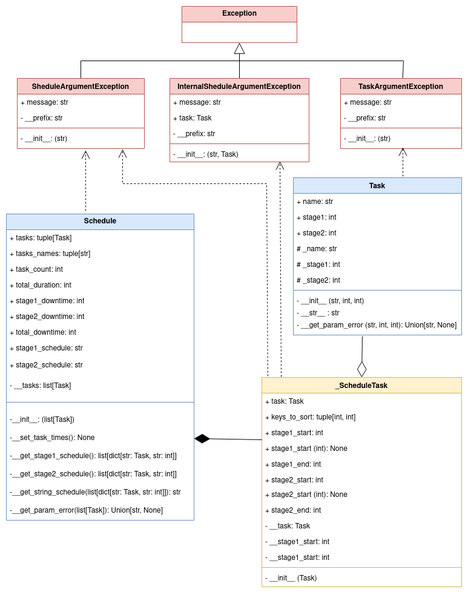

# Задание №8
## Оптимальное расписание. Ленточная стратегия.  
  
1. В файле main.py реализовать свойства и методы класса *Schedule*, который  
предоставляет оптимальное расписание для выполнения заданий с указанным числом   
исполнителей.  
## Примечания  
- Обратить внимание, что некоторые тесты ожидают вызов определенного вида     
исключения с заданным сообщением об ошибке.    
- Разработку вести в отдельной ветке, созданной на основе данной. В названии     
ветки префикс main заменить на название команды.    
- Изменения в ветке должны быть только в файле main.py, различные     
конфигурационные файлы и кэш IDE фиксировать не нужно.    
- Корректность работы класса *Schedule* проверить запустив файл   
test_schedule.py с модульными тестами.  
- Все классы модуля можно проверить запустив файл test_runner.py с   
модульными тестами.     
## Постановка задачи:  
1. Количество заданий произвольно;  
2. Каждое задание имеет собственную длительность;  
3. Задания независимы - несколько заданий может выполнться разными   
исполнителями одновременно, но в каждый момент времени одно задание должно   
выполняться только одним исполнителем;  
4. Разрешены прерывания при выполнении заданий - задание прерванное одним   
исполнителем может быть продолжено другим;  
5. Количество исполнителей произвольно, но не меняется в ходе выполнения   
заданий;  
6. Исполнители универсальны, то есть могут выполнять любые задания  
7. Требуется построить расписание выполнения всех заданий в кратчайшие сроки.  
  
## Ленточная стратегия    
1. Необходимо выбрать наибольшую длительность Tmax среди заданий.    

$$  
T_{max} = max\{t_1, t_2, ..., t_n\}  
$$  

где tn - задание с номером n.  
2. Необходимо рассчитать среднюю продолжительность заданий для одного     
исполнителя Tavg, то есть разделить сумму продолжительностей   
заданий на количество исполнителей.    

$$  
T_{avg} = \frac {\sum_{i=1}^n  t_i}{k}  
$$  

где k - количество исполнителей.  
3. Длительность оптимального расписания Topt определяется как   
максимум из рассчитанных ранее средней продолжительности для исполнителя и   
наибольшей длительности заданий.  

$$  
T_{opt} = max\{T_{max} , T_{avg}\}  
$$  

4. Задания в исходном порядке разрезаются на "ленты" длиной Topt,   
которые распределяются по исполнителям, при этом "разрез ленты" может   
производится внутри задания, что означает прерывание данного задания. Ленты 
могут представляться в виде диаграммы Ганта.

<table border="1px solid black">
	<tr>
		<td>Исполнитель 1</td>
		<td colspan=3>A=4</td>
		<td colspan=4>B=4</td>
		<td colspan=6>C=6</td>
		<td colspan=4>D=4</td>
	</tr>
	<tr>
		<td>Исполнитель 2</td>
		<td colspan=3>D=3</td>
		<td colspan=7>E=7</td>
		<td colspan=7>F=7</td>
	</tr>
	<tr>
		<td>Исполнитель 3</td>
		<td colspan=2>F=2</td>
		<td colspan=10>G=10</td>
		<td colspan=5>H=5</td>
	</tr>
	<tr>
		<td>Исполнитель 4</td>
		<td colspan=7>H=7</td>
		<td colspan=10>I=10</td>
	</tr>
	<tr>
		<td>Исполнитель 5</td>
		<td colspan=7>I=7</td>
		<td colspan=10>Простой=10</td>
	</tr>
	<tr>
		<td colspan=18>Длительнось расписания = 17</td>
	</tr>
</table>

# Диаграмма классов

